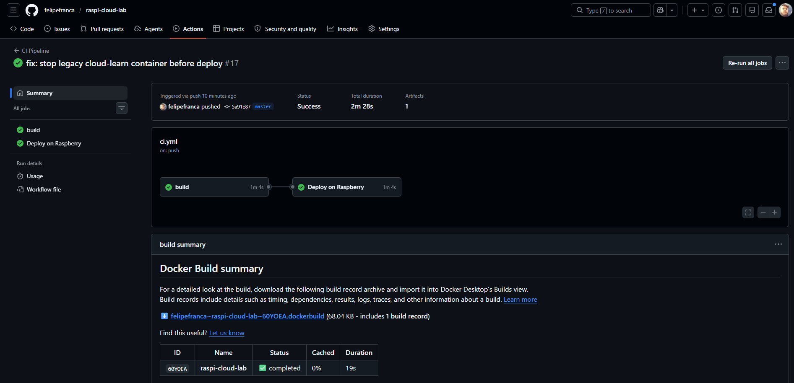
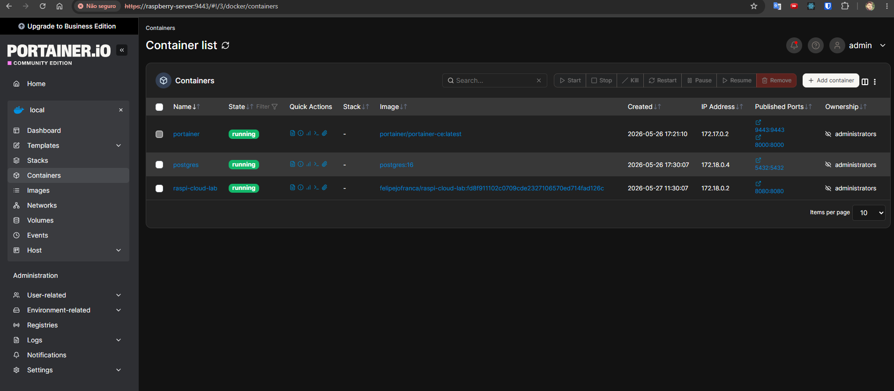
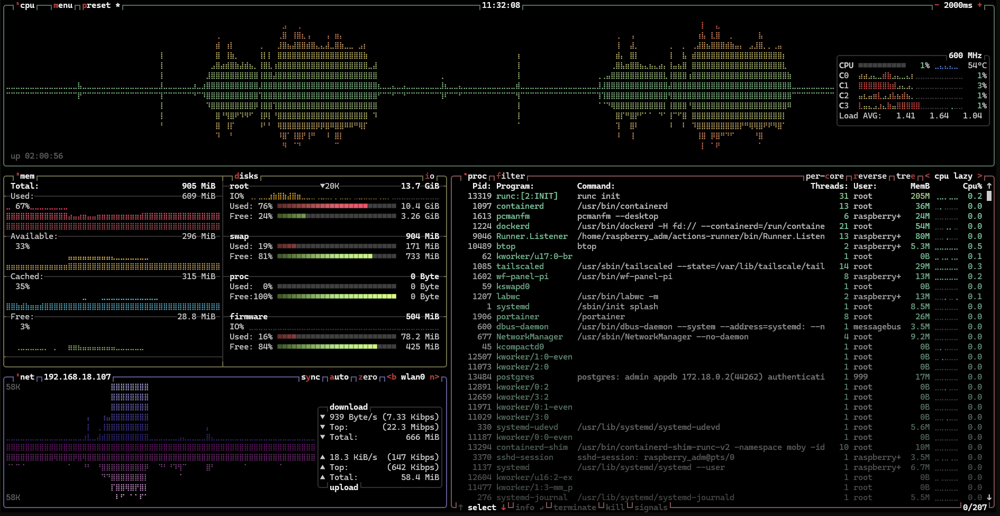
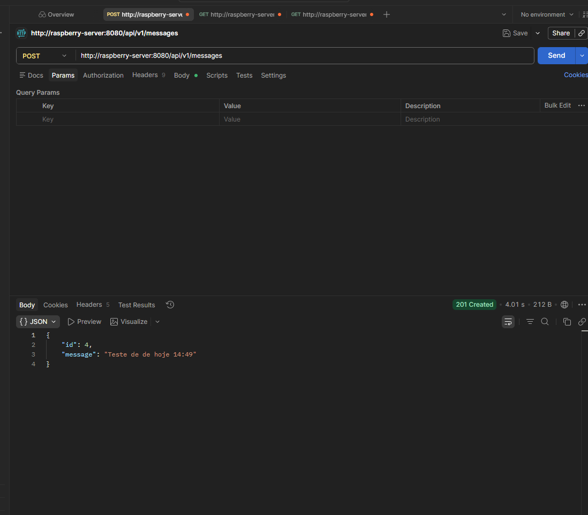
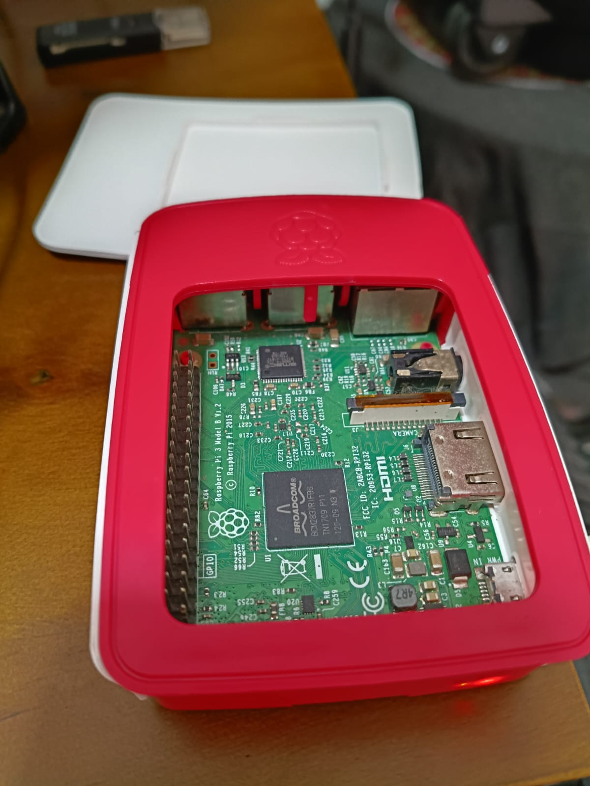
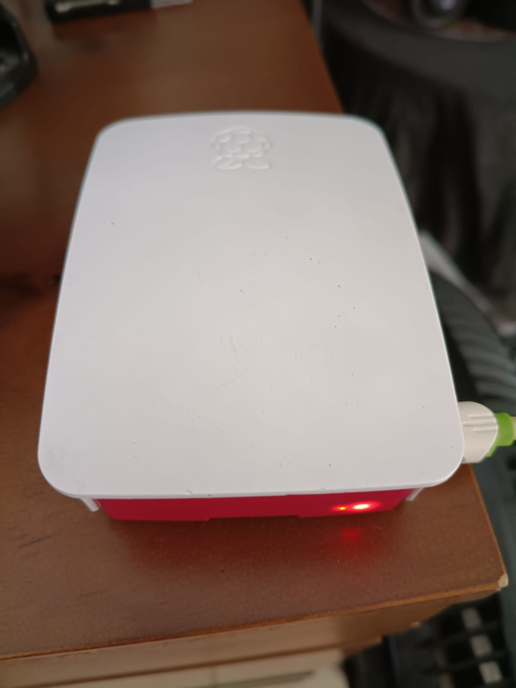

# raspi-cloud-lab

Laboratório prático para aprender Cloud com uma API Java (Spring Boot), Docker, Docker Hub e deploy automático em Raspberry Pi usando GitHub Actions com runner self-hosted.

## Objetivo

O foco deste projeto é aprender CI/CD na forma mais pura, usando um cenário real de homelab com hardware simples.
Em vez de infraestrutura gerenciada em cloud pública, o ciclo inteiro roda em uma Raspberry Pi de uso pessoal para mostrar como publicar, atualizar e operar um sistema fim a fim.

Este projeto demonstra um fluxo completo de CI/CD:

1. Build da aplicação Java com Maven
2. Build e push de imagem Docker multi-arquitetura (`amd64` + `arm64`)
3. Deploy automático na Raspberry Pi (self-hosted runner) com Docker Compose
4. Atualização do container com tag imutável por commit (`github.sha`)

## Escopo do Lab (Tudo na mesma Raspberry)

Neste laboratório, a mesma Raspberry Pi hospeda os componentes principais:

1. Aplicação (`raspi-cloud-lab`)
2. Banco PostgreSQL
3. Portainer (gestão visual dos containers)
4. GitHub Actions Runner self-hosted (job de deploy)

Isso reforça o objetivo didático: entender o ciclo CI/CD completo em ambiente simples, controlado e caseiro.

## Arquitetura

1. `push` na branch `master`
2. GitHub Actions executa job `build` no `ubuntu-latest`
3. Imagem é publicada no Docker Hub com tags por ambiente e versão:
   - `felipejofranca/raspi-cloud-lab:sha-<commit>`
   - `felipejofranca/raspi-cloud-lab:<versao-semver>`
   - `felipejofranca/raspi-cloud-lab:development` (branch `develop`/`development`)
   - `felipejofranca/raspi-cloud-lab:stage` (branch `staging`)
   - `felipejofranca/raspi-cloud-lab:production` e `latest` (branch `master`)
4. Job `deploy` roda na Raspberry (`self-hosted`, `linux`, `arm64`)
5. Runner faz:
   - valida diretórios persistentes em `/data`
   - prepara `.env` com a tag `sha-<commit>`
   - `docker compose pull`
   - `docker compose up -d --remove-orphans`

## Stack

- Java 21
- Spring Boot
- PostgreSQL
- Docker
- GitHub Actions
- Raspberry Pi 3 (aarch64 / arm64)
- Tailscale (conectividade segura entre máquinas)

## Estrutura principal

- `Dockerfile`
- `.github/workflows/ci.yml`
- `src/main/java/com/docker/raspi_cloud_lab`
- `src/main/resources/application.properties`

## Armazenamento na Raspberry (`/data`)

Para reduzir escrita no SD Card, os dados persistentes foram movidos para pendrive montado em `/data`:

- `/data/postgresql`: dados do PostgreSQL
- `/data/volumes/raspi-cloud-lab`: volume de dados da aplicação
- `/data/logs/raspi-cloud-lab`: logs da aplicação
- `/data/backups`: backups

Estrutura:

```text
SD Card (14 GB)
├── Raspberry OS
└── Configurações

Pendrive (59 GB)
├── PostgreSQL
├── Volumes Docker
├── Logs
└── Backups
```

## Pré-requisitos

1. Docker instalado na Raspberry
2. Tailscale instalado e autenticado:
   - máquina de desenvolvimento
   - Raspberry Pi
3. Ambas as máquinas na mesma tailnet
2. Rede Docker criada:

```bash
docker network create cloud-network
```

4. Banco PostgreSQL acessível na mesma rede:
   - host: `postgres`
   - port: `5432`
   - db: `appdb`
   - user: `admin`
   - password: `admin`
5. Runner self-hosted configurado no repositório com labels:
   - `self-hosted`
   - `linux`
   - `arm64`

## Rede (Tailscale)

Neste laboratório, usamos Tailscale nas duas máquinas para acesso remoto seguro:

1. Notebook/desktop de desenvolvimento conectado à tailnet
2. Raspberry Pi conectada à mesma tailnet
3. Hostname da Raspberry acessível por nome MagicDNS, por exemplo:
   - `raspberry-server`

Exemplos de acesso:

```bash
ssh raspberry_adm@raspberry-server
```

```text
http://raspberry-server:8080/api/v1/messages
```

Benefícios no projeto:

1. Não expor SSH/publicação diretamente na internet
2. Acesso estável por hostname, sem depender de IP local dinâmico
3. Facilidade para operar deploy, logs e validações remotamente

## Pipeline (GitHub Actions)

Arquivo: `.github/workflows/ci.yml`

- Job `build`:
  - `mvn clean package -DskipTests`
  - login no Docker Hub
  - build/push multi-arch (`linux/amd64,linux/arm64`)
- Job `deploy`:
  - executa na Raspberry (somente na branch `master`)
  - garante diretórios em `/data`
  - garante rede `cloud-network`
  - sobe/atualiza app e banco com `docker compose`
  - mantém dados persistidos em `/data/postgresql`

## Variáveis de ambiente da aplicação

No deploy, o container recebe:

- `spring.datasource.url=jdbc:postgresql://postgres:5432/appdb`
- `spring.datasource.username=admin`
- `spring.datasource.password=admin`

## Comandos manuais úteis (Raspberry)

Atualizar manualmente com Docker puro:

```bash
docker pull felipejofranca/raspi-cloud-lab:latest
docker stop raspi-cloud-lab || true
docker rm raspi-cloud-lab || true
docker run -d \
  --name raspi-cloud-lab \
  --restart unless-stopped \
  --network cloud-network \
  -p 8080:8080 \
  -v /data/volumes/raspi-cloud-lab:/app/data \
  -v /data/logs/raspi-cloud-lab:/app/logs \
  -e spring.datasource.url="jdbc:postgresql://postgres:5432/appdb" \
  -e spring.datasource.username="admin" \
  -e spring.datasource.password="admin" \
  -e logging.file.path="/app/logs" \
  felipejofranca/raspi-cloud-lab:latest
```

Validar execução:

```bash
docker ps
docker logs -f --tail=100 raspi-cloud-lab
```

## Troubleshooting

### `exec /__cacert_entrypoint.sh: exec format error`

Causa comum: imagem em arquitetura incompatível.

Exemplo do problema:
- host Raspberry: `arm64` (`aarch64`)
- imagem construída apenas para `amd64`

Correção aplicada neste projeto:
- build multi-arquitetura no CI com `linux/amd64,linux/arm64`

### `no match for platform in manifest`

Ocorre quando a base da imagem não suporta a plataforma solicitada (ex.: `linux/arm/v7` em imagem sem suporte).  
Solução: remover a plataforma não suportada do `buildx` ou usar uma base compatível.

## Evidências (prints)

### 1) Workflow com deploy em sucesso



### 2) Container em execução no Portainer



### 3) Monitoramento da Raspberry com btop



### 4) Teste de POST no Postman



## Hardware (Raspberry Pi)

### Raspberry Pi aberta



### Raspberry Pi fechada



## Licença

Defina a licença que preferir (`MIT`, por exemplo) antes de publicar.
